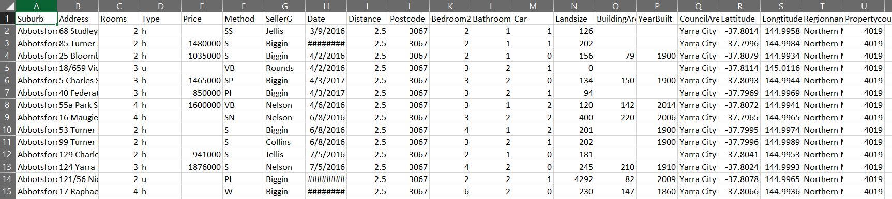
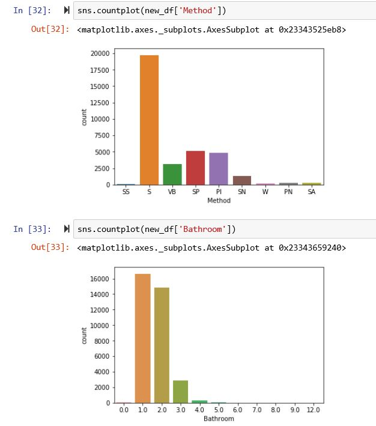
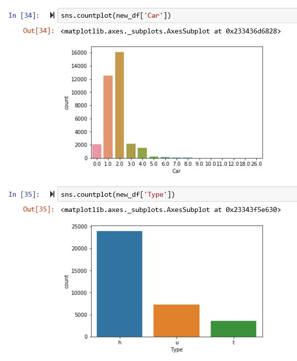
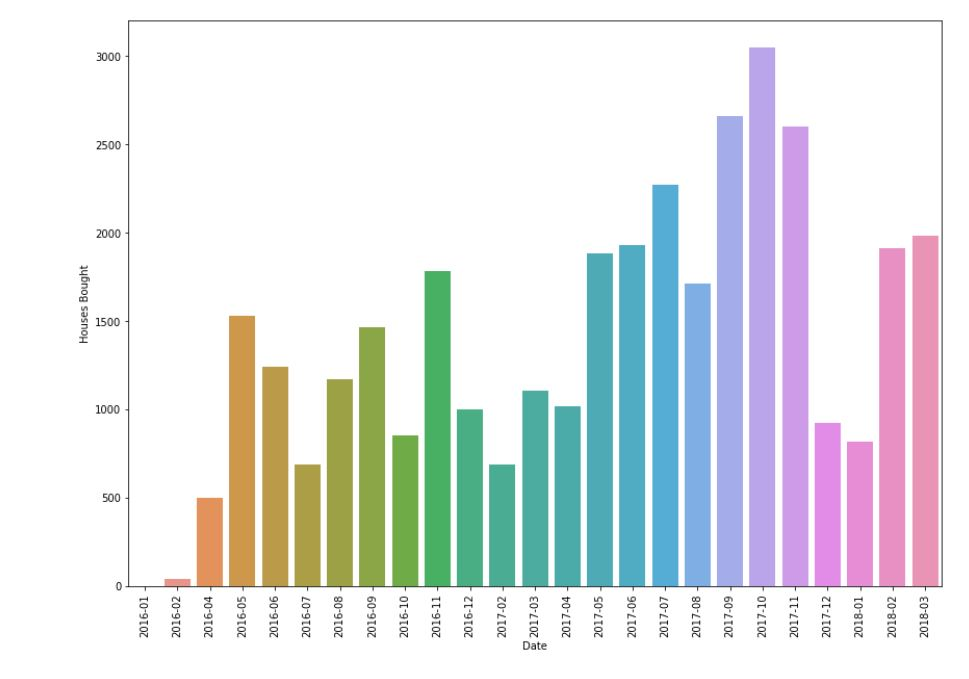

# Melbourne-Housing-Cooldown
## Dataset by Tony Pino (Kaggle)
To analyse the trend of housing prices and figure out the time of cooldown in Melbourne

I started off with basic data exploration, like method of sale of the house, number of rooms, number of bathrooms etc

## Finally conclusion was based on the number of houses bought in the given month.

